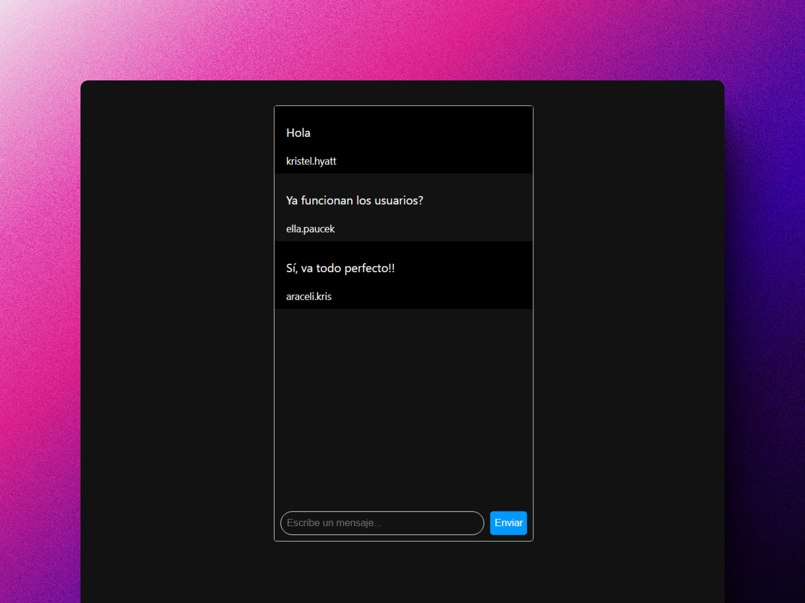

<div align='center'>

# 🗝️ Node + Socket.io: Chat en tiempo real con WebSockets

</div>

### Chat en tiempo real con diferentes usuarios



## Instalación (Windows)

Necesitas tener instalado Node 18+ en tu máquina local.

Clona el repositorio en local:

```shell
git clone https://github.com/abrahamgalue/nodejs-course.git
```

Viaja a la ruta del proyecto:

```shell
cd .\node-js\clase-6\
```

Levanta el servidor en tu entorno local:

```shell
npm run dev
```

Deberías ver algo como esto en tu terminal:

```shell
Restarting '.\\server\\index.js'
server listening on port http://localhost:3000
```

Entra a la url y podrás utilizar el proyecto.

## Instalación (Mac y Linux)

Necesitas tener instalado Node 18+ en tu máquina local.

Clona el repositorio en local:

```shell
git clone https://github.com/abrahamgalue/nodejs-course.git
```

Viaja a la ruta del proyecto:

```shell
cd ./node-js/clase-6/
```

Levanta el servidor en tu entorno local:

```shell
npm run dev:linux
```

Deberías ver algo como esto en tu terminal:

```shell
Restarting './server/index.js'
server listening on port http://localhost:3000
```

Entra a la url y podrás utilizar el proyecto.
