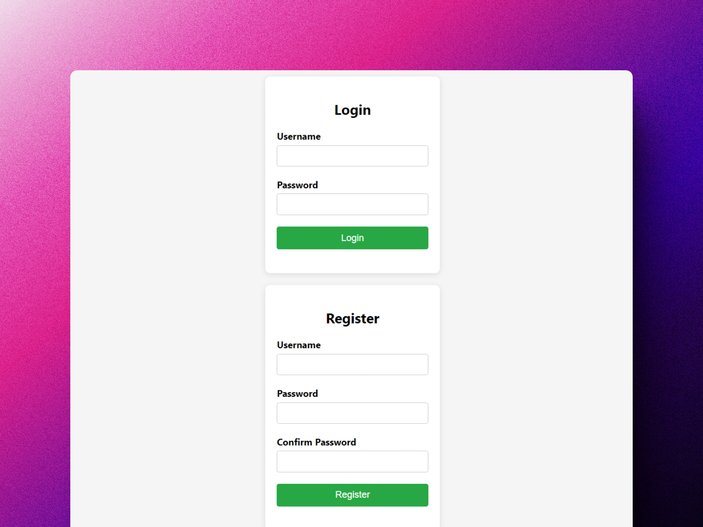
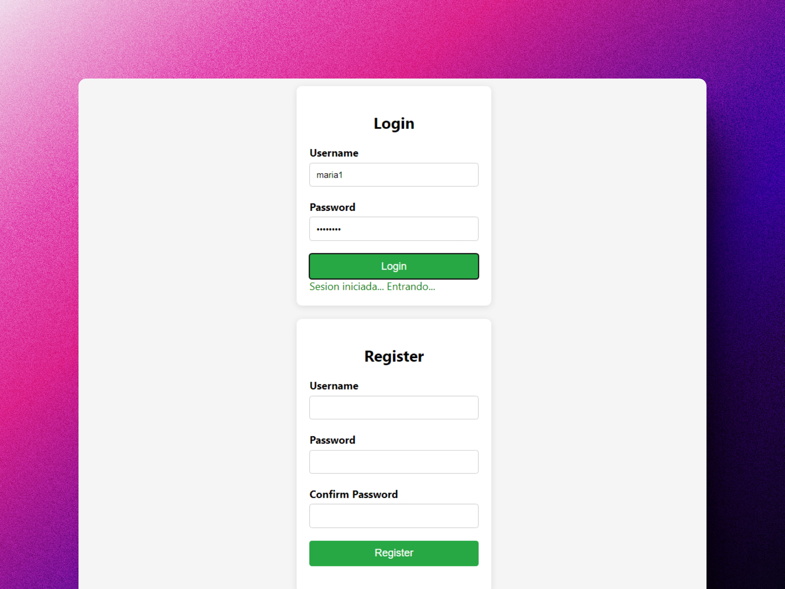
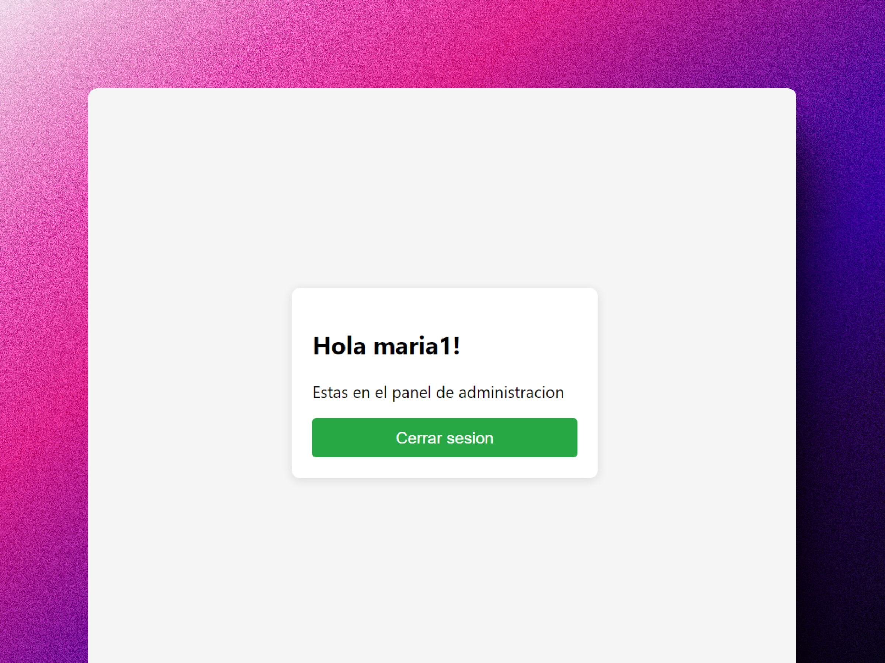

<div align='center'>

# 🗝️ Node: Sesión de usuario, autenticación y autorización

</div>

### Sistema de autenticación de usuario






## Instalación

Necesitas tener instalado Node 18+ en tu máquina local.

Clona el repositorio en local:

```shell
git clone git@github.com:abrahamgalue/nodejs-course.git
```

Viaja a la ruta del proyecto:

**Windows:**

```shell
cd .\node-js\clase-7\
```

**Mac y Linux:**

```shell
cd ./node-js/clase-7/
```

Levanta el servidor en tu entorno local:

```shell
npm run dev
```

Deberías ver algo como esto en tu terminal:

```shell
> clase-7@1.0.0 dev
> node --watch index.js

Server running on http://localhost:3000
```

Entra a la url y podrás utilizar el proyecto.

## Contenido

Este repositorio contiene

1. Instalación del proyecto
2. Usuarios en base de datos
3. Registro de usuarios
4. Autenticación básica con login y password
5. Usando hashes y salts
6. Sesión de usuario con cookies
7. Json Web Tokens
8. Refactorizar con un middleware
9. Cerrar sesión
10. Refresh Token
11. Más adelante: Passport y OAuth 2.0
